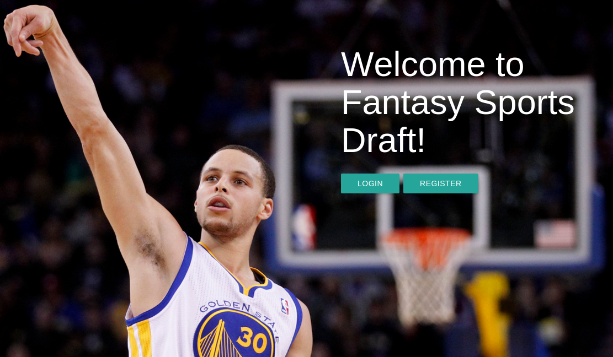
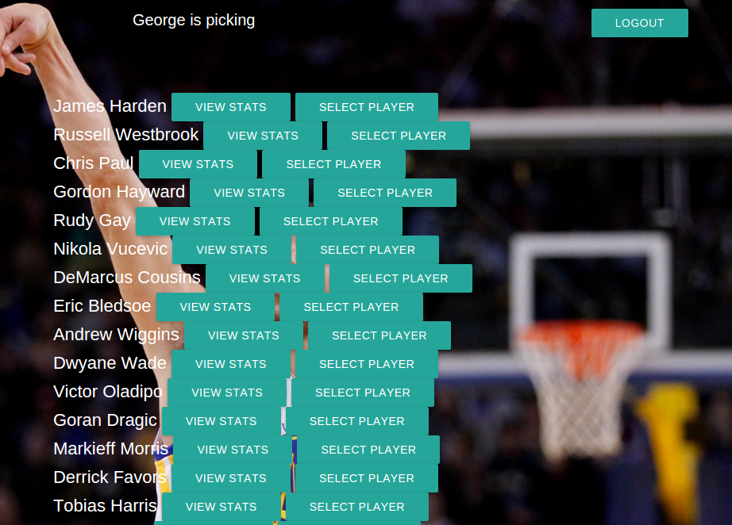
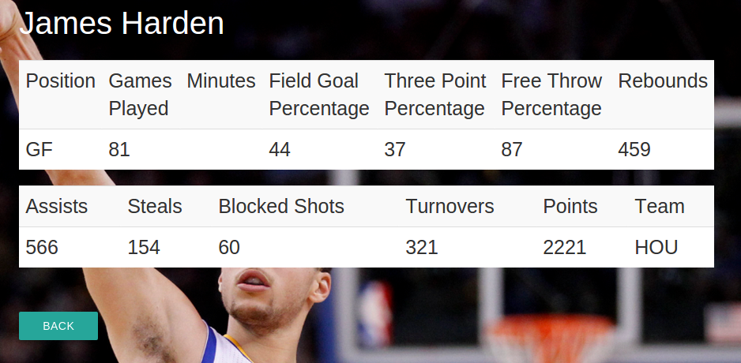

Fantasy Sports Draft

URL: https://fantasy-sports-draft.herokuapp.com/drafts/2/teams

Daniel Knittel

Purpose: The purpose of this website is to allow users to create drafts and select players to their teams with their friends.

Target Users: The target users are people who are sports fans and who enjoy playing fantasy sports and drafting players.

Use cases: A user can signup or login and can create a draft. A user can also set the number of teams and pool of players they want to draft from when creating a new draft. Note: Because there is currently only one API for getting player data, the user must put 'NBA 2015' as the input for pool. Users can create a team, name their team, add players to a team, and view player stats.

When the user is drafting, they have a list of around 500 NBA players to choose from:

Users can also view a player stats by clicking the 'View Stats' button:

Code: This project is built with a sinatra backend and Javascript and AJAX frontend.

Databases: There are 6 tables in the database: users, drafts, pools, teams, draftees, and players. My seed file contains an api call that requests from fantasydata.net and retrieves stats from all NBA players in the 2015 season. 
Controllers: The index controller contains the majority of the logic for the draft itself. The user controller handles user authentication.

AJAX: I utilized AJAX in order to turn my drafts page into a single-page app. When a team clicks on the 'select player' button next to a player, the player is removed from the webpage without refreshing it. The AJAX sends the server the player that was selected so that player can be marked as taken. When the draft finishes, the AJAX call removes all of the 'select player' buttons so no more players can be selected and displays a 'complete 'draft' button, allowing the user to view the results of the draft.

Future features to add: In the future, I would like to see a few additional features added. For example, I would like to have the drafts page display the current team's players so far.

How to contribute: Go to github.com/dknittel/sinatra_fantasy_sports_draft to contribute
